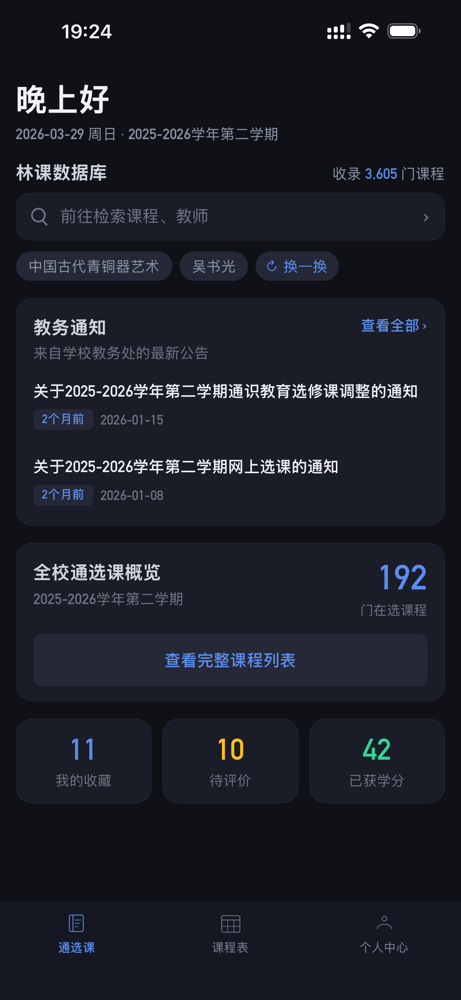
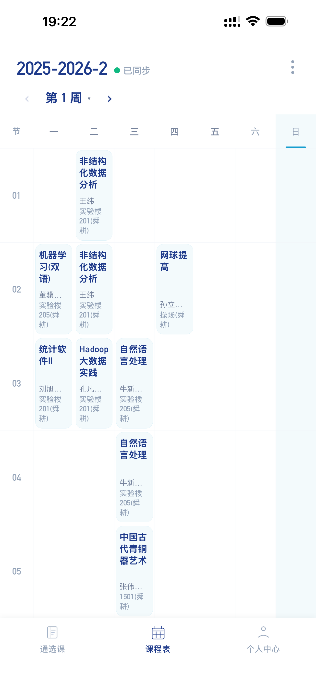
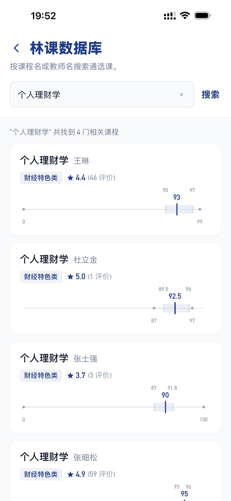
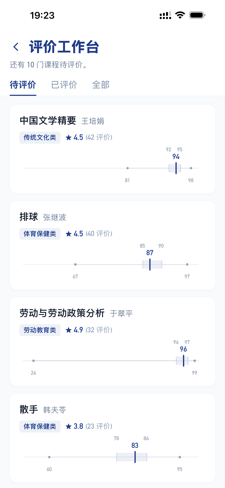
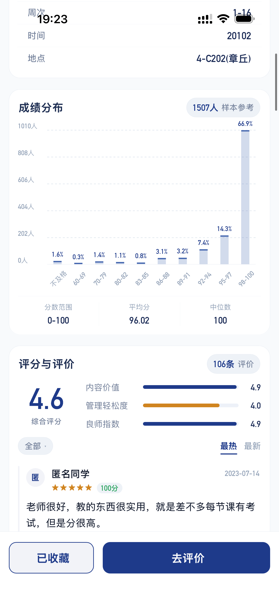
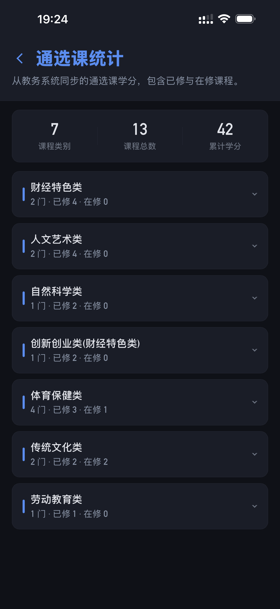

# 林课 Linke

山东财经大学的校园课程客户端：课程评价、课表、成绩、学分一站查询。
一套 uni-app 代码同时产出 **iOS / Android 移动端**，另附 **Electron 桌面端**（内置教务浏览器）。

| 首页 | 课表 | 搜索 | 评价 |
|:---:|:---:|:---:|:---:|
|  |  |  |  |

| 课程详情 | 学分 |
|:---:|:---:|
|  |  |

## 功能

- **课程评价**：星级 + 文字评价，全部来自真实选课学生，只有已出成绩的课程才可评价
- **课表**：对接正方教务系统（jsxsd），周次视图，学期自动对齐
- **成绩 / 学分**：成绩同步与统计，学分完成度
- **课程搜索**：按课程名、教师、学院、学分等条件检索
- **桌面端**：Electron 内置教务浏览器，教务导航收藏、成绩明细、通知聚合等增强面板

## 仓库结构

```
app/          uni-app 移动端（iOS / Android 同源）
desktop/      Electron 桌面端（macOS / Windows）
screenshots/  产品截图
CHANGELOG.md  发版日志
```

## 构建与运行

### 移动端（app/）

1. 安装 [HBuilderX](https://www.dcloud.io/hbuilderx.html)。
2. 用 HBuilderX 打开 `app/` 目录。
3. 「运行」可连真机/模拟器调试；「发行」可打 App 包（wgt 热更新资源或整包）。
4. 首次运行需在 HBuilderX 中登录 DCloud 账号并配置 App 证书（iOS）或使用公共测试证书（Android 调试）。

### 桌面端（desktop/）

```bash
cd desktop
npm install
npm run dev      # 开发调试
npm run build    # 构建
```

## 后端边界说明

本仓库只包含**客户端**代码。林课后端（PhalApi）与云端验证码识别服务**不开源**：

- 客户端默认连接官方 API（`api.linketeam.com`），API 地址在代码中可见属预期设计——防护依靠服务端鉴权、限流与热更新完整性校验，不依赖地址隐藏。
- 客户端代码坚持零秘密原则：仓库中不应存在任何有效密钥、口令或令牌；签名证书、keystore 等材料只存在于本地（见 `.gitignore`）。

## 安全

发现安全问题请勿公开 Issue，参见仓库 SECURITY 说明或直接联系维护者。

## 许可

[MIT](LICENSE) © The Linke App Authors
